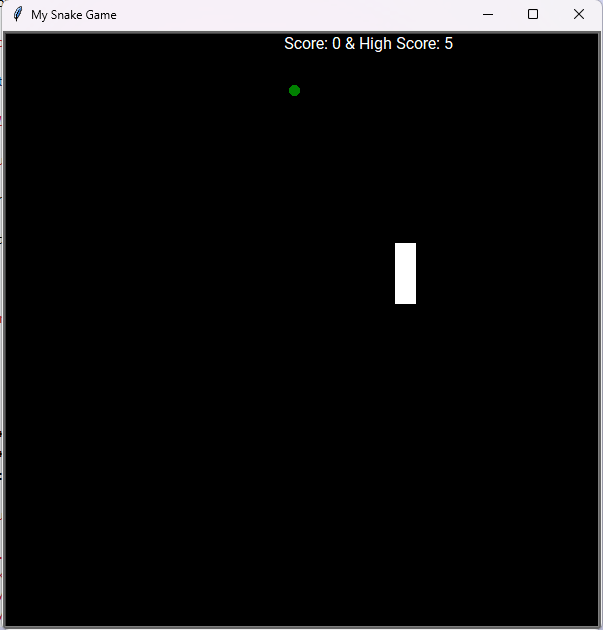

## Description

This project provides a basic Snake game where the player controls a snake. The snake eats food to grow longer and the player must avoid colliding with the walls or the snake's own body. The game features a scoreboard that tracks the player's score and the high score, which is stored in the `data.txt` file.

## Features

*   Classic Snake gameplay
*   Score tracking
*   High score persistence
*   Simple controls using arrow keys
*   Collision detection with walls and self

## Screenshot Placeholder



## How to Run

1.  Make sure you have Python 3 installed.
2.  Install the `turtle` module (it usually comes pre-installed with Python).
3.  Download all the files (`main.py`, `snake.py`, `food.py`, `scoreboard.py`, `data.txt`).
4.  Run the game by executing `main.py`:

    ```bash
python main.py
```

## Controls

*   **Up:** Up arrow key
*   **Down:** Down arrow key
*   **Left:** Left arrow key
*   **Right:** Right arrow key

## File Structure

*   `README.md`: This file, providing information about the game.
*   `data.txt`: Stores the high score.
*   `food.py`: Defines the Food class.
*   `main.py`: The main game file, containing the game loop and screen setup.
*   `scoreboard.py`: Defines the Scoreboard class.
*   `snake.py`: Defines the Snake class.

## Classes

*   **Snake (snake.py):**
    *   `\_\_init\_\_()`: Initializes the snake with starting positions.
    *   `create_snake()`: Creates the initial snake body.
    *   `add_snake_body(position)`: Adds a segment to the snake's body.
    *   `extend_snake()`: Extends the snake when it eats food.
    *   `move()`: Moves the snake forward.
    *   `up()`, `down()`, `left()`, `right()`: Controls the snake's direction.
        `reset()`: Reset the snake to initial state

*   **Food (food.py):**
    *   `\_\_init\_\_()`: Initializes the food at a random location.
    *   `refresh_food()`: Moves the food to a new random location.

*   **Scoreboard (scoreboard.py):**
    *   `\_\_init\_\_()`: Initializes the scoreboard.
    *   `update_scoreboard()`: Updates the displayed score.
    *   `reset()`: Resets the score and updates the high score if necessary.
    *   `increase()`: Increases the score.
    *   `read_score()`: Reads the high score from `data.txt`.
    *   `write_score()`: Writes the high score to `data.txt`.

## High Score

The high score is stored in the `data.txt` file.

## Credits

This game was created by arpan8925.

## License

[Choose a license and add it here] (e.g., MIT License)
ke game using the Python turtle module.

## Description

This project provides a basic Snake game where the player controls a snake. The snake eats food to grow longer and the player must avoid colliding with the walls or the snake's own body. The game features a scoreboard that tracks the player's score and the high score, which is stored in the `data.txt` file.

## Features

*   Classic Snake gameplay
*   Score tracking
*   High score persistence
*   Simple controls using arrow keys
*   Collision detection with walls and self

## How to Run

1.  Make sure you have Python 3 installed.
2.  Install the `turtle` module (it usually comes pre-installed with Python).
3.  Download all the files (`main.py`, `snake.py`, `food.py`, `scoreboard.py`, `data.txt`).
4.  Run the game by executing `main.py`:

```bash
python main.py
```

## Controls

*   **Up:** Up arrow key
*   **Down:** Down arrow key
*   **Left:** Left arrow key
*   **Right:** Right arrow key

## File Structure

*   `README.md`: This file, providing information about the game.
*   `data.txt`: Stores the high score.
*   `food.py`: Defines the Food class.
*   `main.py`: The main game file, containing the game loop and screen setup.
*   `scoreboard.py`: Defines the Scoreboard class.
*   `snake.py`: Defines the Snake class.

## Classes

*   **Snake (snake.py):**
    *   `\_\_init\_\_()`: Initializes the snake with starting positions.
    *   `create_snake()`: Creates the initial snake body.
    *   `add_snake_body(position)`: Adds a segment to the snake's body.
    *   `extend_snake()`: Extends the snake when it eats food.
    *   `move()`: Moves the snake forward.
    *   `up()`, `down()`, `left()`, `right()`: Controls the snake's direction.
        `reset()`: Reset the snake to initial state

*   **Food (food.py):**
    *   `\_\_init\_\_()`: Initializes the food at a random location.
    *   `refresh_food()`: Moves the food to a new random location.

*   **Scoreboard (scoreboard.py):**
    *   `\_\_init\_\_()`: Initializes the scoreboard.
    *   `update_scoreboard()`: Updates the displayed score.
    *   `reset()`: Resets the score and updates the high score if necessary.
    *   `increase()`: Increases the score.
    *   `read_score()`: Reads the high score from `data.txt`.
    *   `write_score()`: Writes the high score to `data.txt`.

## High Score

The high score is stored in the `data.txt` file.

## Credits

This game was created by arpan8925.

## License

[Choose a license and add it here] (e.g., MIT License)
